<!-- ===================================================== -->
<!--                GITHUB PROFILE README                  -->
<!-- ===================================================== -->

<p align="center">
  
</p>

<h1 align="center">
Hi 👋 I'm Muhammad Talha
</h1>

<h3 align="center">
🚀 MERN Stack Developer • Python Developer • AI Engineering Learner
</h3>

<p align="center">
Building the future, one <b>commit</b> at a time.
</p>

<p align="center">

</p>

<p align="center">

</p>

<p align="center">


</p>

<p align="center">

</p>

# 👨‍💻 About Me
 
<p align="center">

</p>
<p align="center">

</p>
<p align="center">

&nbsp;&nbsp;&nbsp;&nbsp;&nbsp;

</p>
<table>
<tr>
<td width="55%" valign="middle">
  
### 👋 Hi, I'm Talha!
 
I'm a Computer Science student who loves turning ideas into real, working products — from clean backend logic to smooth, user-friendly interfaces. Right now I'm deep into the MERN stack and Python, while steadily leveling up toward AI Engineering and system design. I enjoy the process as much as the outcome: reading docs, breaking things, fixing them, and shipping something better each time.
 
</td>
<td width="45%" align="center" valign="middle">

</td>
</tr>
</table>
<p align="center">


</p>

### ⚡ Fun Fact
 
> I love turning coffee ☕ into code.
 
<p align="center">

</p>

# 🛠 Tech Stack

<p align="center">


</p>

<p align="center">

</p>
<!-- ===================================================== -->
<!--                 GITHUB ANALYTICS                      -->
<!-- ===================================================== -->

# 📊 GitHub Analytics

<p align="center">

  

  

</p>

<br>

<p align="center">

  

</p>

<p align="center">
  
</p>

# 📈 Contribution Graph

<p align="center">


</p>

<p align="center">

</p>

# 🐍 Contribution Snake

<p align="center">


</p>


<p align="center">

</p>
<!-- ===================================================== -->
<!--                FEATURED PROJECTS                      -->
<!-- ===================================================== -->

# 🚀 Featured Projects

<table width="100%">

<tr>

<td width="33%" valign="top">

### 🛒&nbsp; Product Store

<p>A complete Full Stack PERN application.</p>

   

<a href="https://github.com/Muhammad-Talha236/Product_Store"></a>
&nbsp;

</td>

<td width="33%" valign="top">

### 💬&nbsp; Smart Campus AI

<p>Modern realtime AI Campus Agent</p>

  

<a href="https://github.com/Muhammad-Talha236/Smart_Campus_AI"></a>
&nbsp;

</td>

<td width="33%" valign="top">

### 💰&nbsp; Expense Tracker

<p>Track your expenses with beautiful charts and analytics.</p>

  

<a href="https://github.com/Muhammad-Talha236/Split_Nest"></a>
&nbsp;

</td>

</tr>

<tr>

<td width="33%" valign="top">

### 🤖&nbsp; Event Manager(Eventra_)

<p>A Full Stack Application for Managing Event</p>

  

<a href="https://github.com/Muhammad-Talha236/Eventra_"></a>
&nbsp;

</td>

<td width="33%" valign="top">

### 🌤&nbsp; Weather App

<p>Weather forecast application with a clean, responsive UI.</p>

  

<a href="https://github.com/Muhammad-Talha236/weather_app"></a>
&nbsp;

</td>

<td width="33%" valign="top">

### 🌐&nbsp; Core Banking System

<p>DataBase Project, Handling Core fundamentals of Bank</p>

  

<a href="https://github.com/Muhammad-Talha236/Data_Base_Project-CBS-"></a>
&nbsp;

</td>

</tr>

</table>

<p align="center">
<a href="https://github.com/Muhammad-Talha236?tab=repositories">

</a>
</p>

<p align="center">

</p>

# 🎯 Current Goals

- 🚀 Become an Expert MERN Stack Developer
- 🐍 Master Advanced Python
- 🤖 Learn AI Engineering & LLMs
- ☁ Learn Docker & Cloud Deployment
- 🏗 Build Production Ready Applications
- 📚 Practice DSA Daily
- 💼 Land a High-Paying Software Engineering Role

<p align="center">

</p>

# Github History 


<p align="center">

</p>

<p align="center">


</p>

<p align="center">

</p>

<!-- ===================================================== -->
<!--                 CONNECT WITH ME                       -->
<!-- ===================================================== -->

# 🌐 Connect With Me

<p align="center">

<a href="https://www.linkedin.com/in/muhammad-talha-7439122b7/" target="blank">

</a>

<a href="https://github.com/Muhammad-Talha236" target="blank">

</a>

<a href="mailto:mtalha.mt236@gmail.com" target="blank">

</a>

<a href="https://twitter.com/YOUR_USERNAME" target="blank">

</a>

<a href="https://www.instagram.com/_mian.talha_/" target="blank">

</a>

</p>

<p align="center">

</p>

# 🎵 Currently Coding To

<p align="center">
<a href="https://github.com/kittinan/spotify-github-profile">

</a>
</p>

<p align="center">

</p>

# 💻 Daily Motivation

<p align="center">


</p>

<p align="center">

</p>

# 📈 Visitor Counter

<p align="center">

</p>

<p align="center">

</p>

<p align="center">
<sub>Thanks for stopping by — every visit makes my day! 🚀</sub>
</p>

<p align="center">

</p>

# ☕ Support Me

<p align="center">
If you like my work, consider buying me a coffee — it keeps the commits flowing! 🚀
</p>

<p align="center">

<a href="https://buymeacoffee.com/">

</a>
&nbsp;
<a href="https://ko-fi.com/">

</a>

</p>

<p align="center">

</p>

# 🏆 Coding Philosophy

```cpp
while(alive)
{
    Learn();
    Build();
    Improve();
    Repeat();
}
```

<p align="center">

</p>

# 💡 Favorite Quote

<p align="center">

</p>

<blockquote align="center">
<h3><i>"The best error message is the one that never shows up."</i></h3>
<p>— Thomas Fuchs</p>
</blockquote>

<p align="center">

</p>

# ⚡ Fun Fact

<table align="center">
<tr>
<td align="center">

🕵️ **Debugging is...**

being the detective in a crime movie 🎬

where you are *also* the criminal 😅

</td>
</tr>
</table>

<p align="center">

</p>

<p align="center">


</p>

<p align="center">

</p>

<p align="center">


</p>
